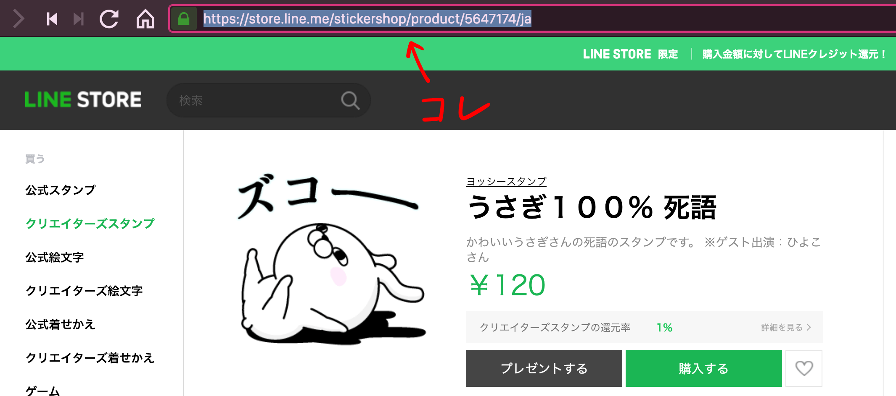

# stamp-dl

## Description

LINE STORE から LINE スタンプの画像(.png)をダウンロードするためのコマンドラインツール

## Download

ターミナルで ↓ を実行 (どこからでも`stamp-dl`コマンドが使えるようになるはず...)

```console
curl -o stamp-dl https://gist.githubusercontent.com/makitune/87f53149bbfec5ef206fb31ad8ce8e86/raw/c5099554d8200d5e835f25764747639c28be8dc9/stamp-dl_darwin_amd64; chmod 755 stamp-dl; mv stamp-dl /usr/local/bin/
```

実行すると`/usr/local/bin`にバイナリが配置される。(削除する時はココを探して！)

## Usage

引数に LINE STORE の LINE スタンプページの URL を指定する。

```console
stamp-dl "ここにLINEスタンプページのURLを入れて！"
```

### 例

- 通常  
  実行したディレクトリに保存される。

```console
stamp-dl "https://store.line.me/stickershop/product/5647174/ja"
```



- デスクトップに保存する場合

```console
stamp-dl -o ~/Desktop "https://store.line.me/stickershop/product/5647174/ja"
```

- 完了時に Finder で表示しない場合

```console
stamp-dl -q "https://store.line.me/stickershop/product/5647174/ja"
```

- いっぱい

```console
stamp-dl "https://store.line.me/stickershop/product/5647174/ja" "https://store.line.me/stickershop/product/1625544/ja" "https://store.line.me/stickershop/product/1435028/ja"
```
